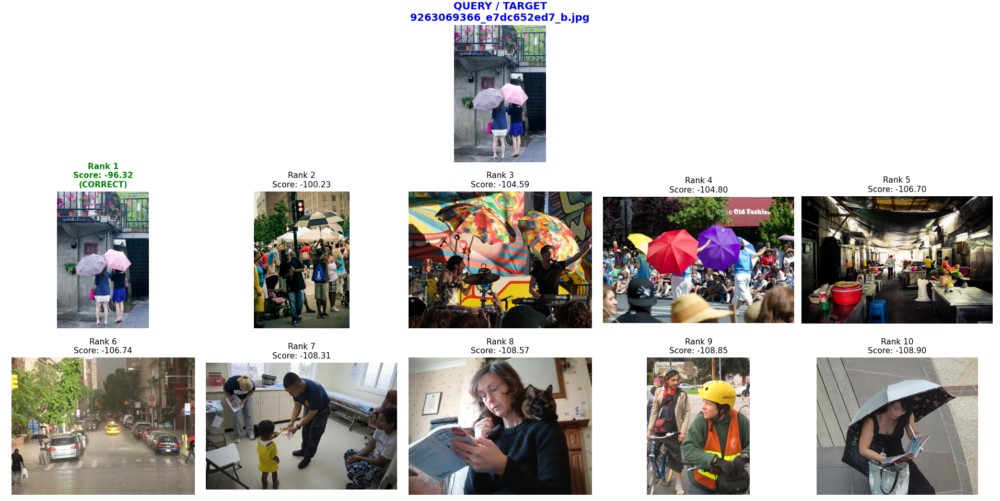
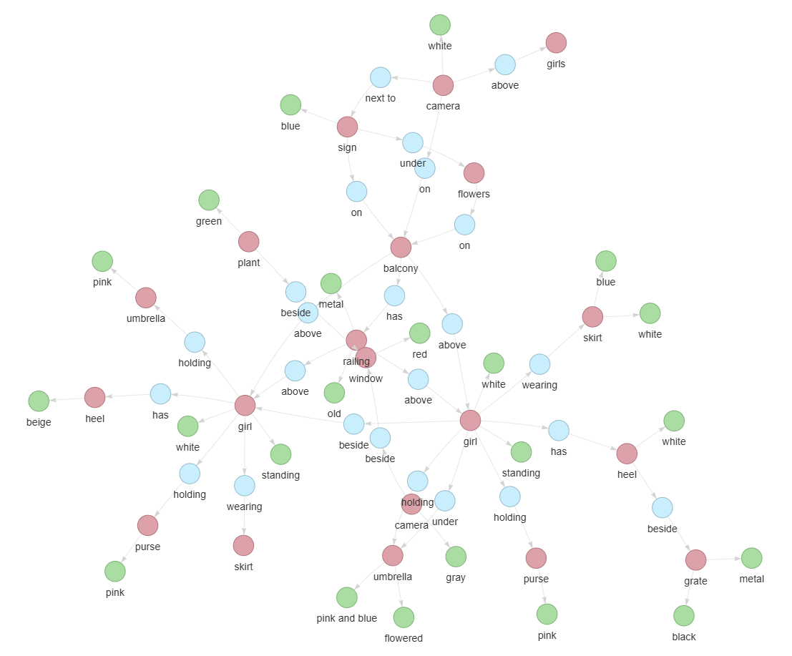
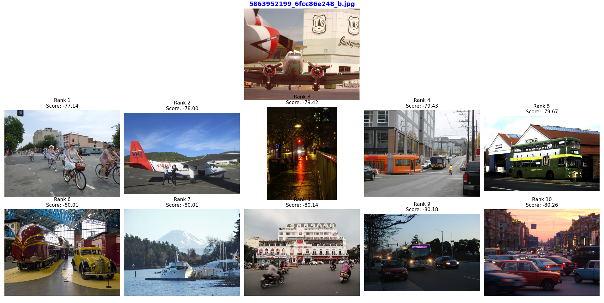
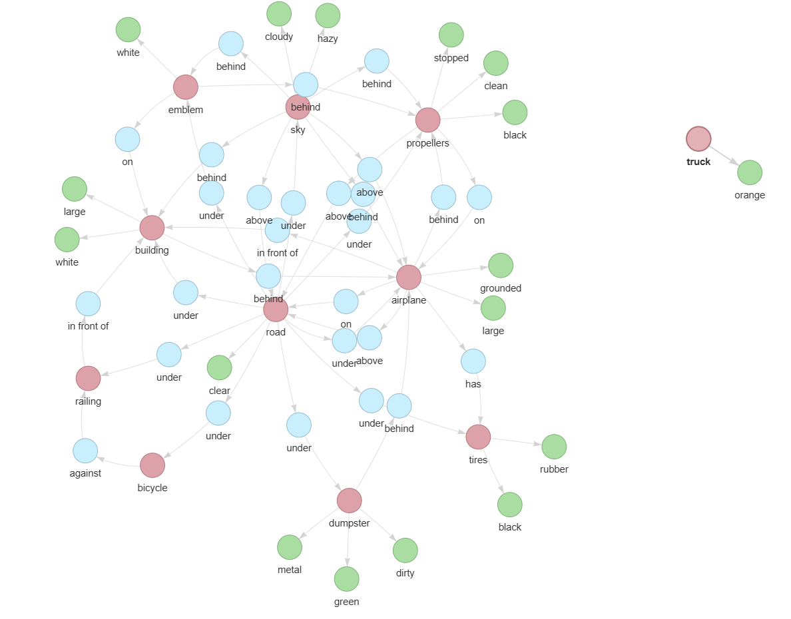
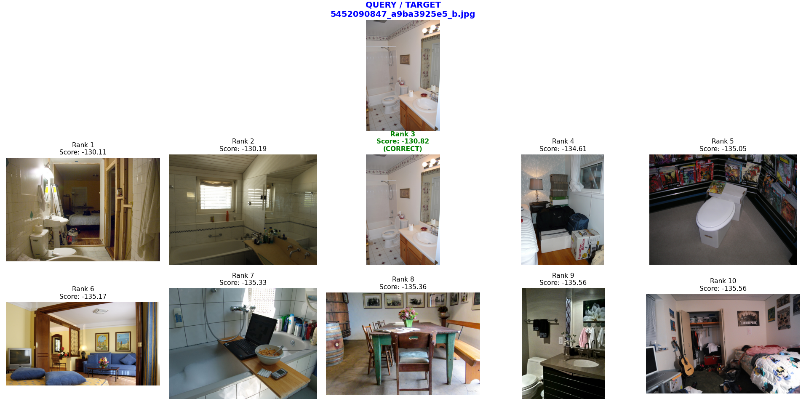
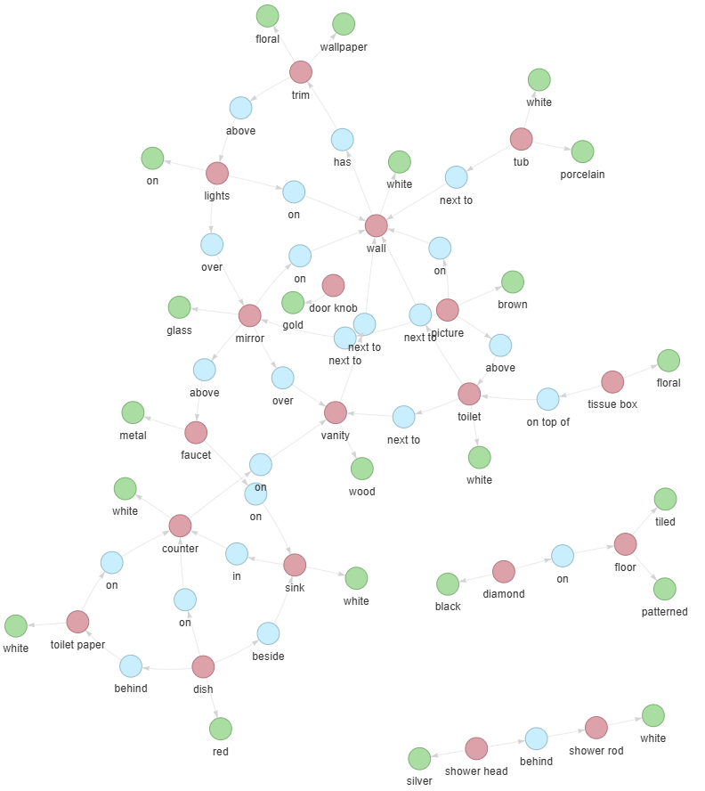

# Reproducibility Study: Semantic Image Retrieval via Scene Graphs

**Aymane Hamdaoui, Titouan Duhazé, Chris Essomba** — ENS Paris-Saclay

> A reproducibility study of the semantic image retrieval system proposed by Johnson et al. (CVPR 2015). We reconstruct the full pipeline — from Geodesic Object Proposals to CRF inference — and document the critical, previously unpublished engineering heuristics required for convergence. Our implementation achieves **17.5% Recall@1**, outperforming the original baseline (13.3%), with a **450× inference speedup** via Vectorized Beam Search.

---

## Table of Contents

1. [Overview](#overview)
2. [Methodology](#methodology)
3. [Reproducibility Challenges & Resolutions](#reproducibility-challenges--resolutions)
4. [Implementation Details](#implementation-details)
5. [Results](#results)
6. [Qualitative Results](#qualitative-results)
7. [Discussion](#discussion)
8. [Installation & Usage](#installation--usage)
9. [References](#references)

---

## Overview

Traditional keyword-based image retrieval fails for complex queries involving objects, attributes, and spatial relationships. **Scene Graphs** offer a structured representation that captures this richness. The core challenge is *grounding* a structured query onto specific image regions — a problem that is inherently NP-hard.

Johnson et al. (2015) proposed a pipeline using **Conditional Random Fields (CRFs)** to model the joint probability of assigning query objects to image regions. While the theoretical framework is well-documented, the specific engineering decisions required to make such a system converge are largely omitted from the original publication.

This repository provides a **complete, end-to-end reimplementation** that:
- Identifies and resolves critical undocumented hyperparameters
- Introduces a Vectorized Beam Search replacing Max-Product Belief Propagation
- Provides rigorous statistical evaluation with variance estimates

---

## Methodology

### Problem Formulation

Given an image $I$ and a scene graph query $Q = (V, E)$, the goal is to find the optimal grounding $\gamma: V \to B$ that assigns each query object $o \in V$ to a candidate bounding box $\gamma(o) \in B$.

The grounding probability is modeled as a CRF:

$$P(\gamma \mid I, Q) = \frac{1}{Z(I,Q)} \prod_{o \in V} \Phi(o, \gamma(o)) \prod_{(o_i, r, o_j) \in E} \Psi(\gamma(o_i), \gamma(o_j), r)$$

| Symbol | Meaning |
|--------|---------|
| $\Phi(o, b)$ | **Unary Potential** — likelihood that box $b$ looks like object class $o$ |
| $\Psi(b_i, b_j, r)$ | **Binary Potential** — likelihood that boxes $b_i, b_j$ satisfy relationship $r$ |
| $Z(I, Q)$ | Partition function (normalization constant) |

### Candidate Generation & Feature Extraction

1. **Geodesic Object Proposals (GOP)** generate candidate regions (~605 boxes/image on average).
2. Each region is warped to 227×227 and passed through an **AlexNet** (pre-trained on ImageNet-1K).
3. The **fc7** layer output yields a 4096-dimensional feature vector $\mathbf{v}_k$ per box.

Training labels are assigned via IoU overlap with ground-truth:
- **Positive (IoU > 0.5):** assigned the object class (266 classes) and attribute labels (145 types)
- **Negative (IoU < 0.3):** classified as background

To counter the ~80% background class imbalance, we use a `WeightedRandomSampler` enforcing a mini-batch of **32 positive / 96 background** samples (128 total).

### Unary Potentials (Appearance)

Linear SVMs trained One-vs-Rest, with scores calibrated via **Platt Scaling**:

$$\Phi(o, b) = \sigma\!\left(A_o \cdot (\mathbf{w}_o^\top \mathbf{v}_b) + B_o\right)$$

where $\sigma$ is the sigmoid function and $A_o, B_o$ are learned on the validation set.

### Binary Potentials (Spatial Relations)

A scale-invariant geometric feature vector encodes relative position:

$$f_{\text{geo}}(b_i, b_j) = \left[\frac{x_i - x_j}{w_i},\; \frac{y_i - y_j}{h_i},\; \frac{w_j}{w_i},\; \frac{h_j}{h_i}\right]$$

The distribution is modeled with **Gaussian Mixture Models (GMMs)**, calibrated via Platt Scaling:

$$\Psi(b_i, b_j, r) = \sigma\!\left(A_r \cdot \log \mathcal{L}(f_{\text{geo}} \mid \theta_r) + B_r\right)$$

If sufficient training data exists for a specific triplet $(o_i, r, o_j)$ with $N \geq 30$ samples, we use specific parameters $\theta_{o_i, r, o_j}$; otherwise we fall back to generic parameters $\theta_r$.

---

## Reproducibility Challenges & Resolutions

A primary contribution of this study is identifying critical hyperparameters **omitted from the original text**. The system's convergence is highly sensitive to the following:

### 1. Data Accessibility

The exact 5,000-image subset and scene graph annotations are not available through official channels. We located them via an [unindexed Google Drive link](https://drive.google.com/file/d/0Byvt-AfX75o1SVBTWFlPRGZGTXc/view?resourcekey=0-V3fW-908CLk30sxFVE9B-w). The dataset also lacks a formal license, defaulting legally to "all rights reserved" despite informal statements otherwise.

### 2. Vocabulary Normalization

Raw annotations contain far more unique strings than the reported 266 classes (compound nouns, rare instances). We applied:
- **Lexical Reduction:** compound nouns → head noun (e.g., "front wheels" → "wheels")
- **OOV Exclusion:** entities unmappable to the 266-class vocabulary were excluded

### 3. GMM Component Selection

**Problem:** Number of mixture components $K$ unspecified; fitting on rare relationships causes singular covariance matrices.

**Resolution:** Dynamic selection with $K_r = \min(6, N_r)$ and a strict lower bound $N_r \geq 2$.

### 4. Generic Fallback Threshold

**Problem:** The threshold for switching between specific and generic spatial models is undefined.

**Resolution:** Empirically determined $\tau = 30$:

$$\Psi = \begin{cases} \mathcal{L}(f_{\text{geo}} \mid \theta_{o_i, r, o_j}) & \text{if } N_{o_i, r, o_j} \geq 30 \\ \mathcal{L}(f_{\text{geo}} \mid \theta_r) & \text{otherwise} \end{cases}$$

### 5. Calibration Negative Sampling

**Problem:** Positive-to-negative ratio for Platt Scaling unspecified; imbalance > 100:1 collapses probabilities to zero.

**Resolution:** **Hard Negative Mining** with fixed ratio 1:3, i.e. $|S_{\text{neg}}| = \min(|\mathcal{N}|,\; 3 \cdot |S_{\text{pos}}|)$.

---

## Implementation Details

### Data Splits

| Split | Proportion | Purpose |
|-------|-----------|---------|
| Train | 80% | SVM hyperplanes $\mathbf{w}_o$ and GMM parameters $\theta_r$ |
| Validation | 20% | Platt Scaling parameters $(A, B)$ |
| Test | Held-out | Final Recall@K evaluation |

GMMs never observe the validation set, ensuring unbiased calibration.

### Vectorized Beam Search

Finding the MAP grounding is NP-hard. Instead of Max-Product Belief Propagation, we implement a **Vectorized Beam Search** ($K_{\text{beam}} = 5$):

1. **Initialize** with an empty hypothesis set $\mathcal{H} = \{(\emptyset, 0)\}$
2. **For each query object** $o_k$:
   - Compute unary scores for all $M$ boxes via matrix operations
   - Extend each partial grounding in $\mathcal{H}$ across all $M$ boxes
   - Add binary potentials for edges connecting $o_k$ to previously assigned nodes
   - **Prune** to top $K_{\text{beam}}$ candidates
3. **Return** highest-scoring grounding $\gamma^*$

**Complexity:** $O(N \cdot M \cdot K_{\text{beam}})$ — linear in query size vs. the naive $O(M^N)$.

By vectorizing spatial feature computations into tensor operations (NumPy broadcasting → BLAS/LAPACK), we achieve **~0.003s per image** (vs. ~1.4s naive), a **450× speedup**.

---

## Results

### Quantitative Evaluation

| Metric | Ours ($N$=100) | Ours ($N$=1000) | Ours (10×150 queries) | Johnson et al. |
|--------|:-:|:-:|:-:|:-:|
| Recall@1 | 35.0% | 16.0% | **17.5%** | 13.3% |
| Recall@5 | 59.0% | 32.5% | 34.7% | 30.7% |
| Recall@10 | 70.0% | 41.7% | 42.9% | 43.3% |
| **Median Rank** | **3.0** | **19.0** | **19.6** | **14.0** |

Large-scale results (10 × 150 queries) report the **mean across 10 independent repetitions** (σ = 3.15% for Recall@1). The original paper reports single point estimates without variance metrics.

### Latency

- **~6.1s per query** against 1,000 images (~6ms per image comparison)
- Confirms scalability of the Vectorized Beam Search

### Error Analysis

Two primary failure modes:

1. **Semantic Ambiguity:** Generic queries (e.g., "tree next to building") match many images equally well.
2. **Proposal & Feature Limitations:** GOP misses critical objects; AlexNet features lack the discriminative power of modern architectures, causing "semantic sibling" confusion (e.g., planes ↔ boats).

### Qualitative Results

#### Success Case (Rank 1)

The model successfully leverages both object appearance and spatial relationships to retrieve the exact ground-truth image.

<p align="center">
  
  &nbsp;&nbsp;
  
</p>
<p align="center"><em>Left: Top retrieved image (Rank 1). Right: Query scene graph.</em></p>

When GOP generates accurate candidate boxes, the CRF engine effectively combines strong unary visual priors with binary spatial potentials to filter structural distractors and find the exact geometric match.

#### Failure Case (Rank 657)

GOP fails to propose a bounding box for a critical query object, preventing the CRF from grounding the full graph.

<p align="center">
  
  &nbsp;&nbsp;
  
</p>
<p align="center"><em>Left: Incorrect top retrieved image. Right: Query scene graph. Ground-truth retrieved at Rank 657.</em></p>

This highlights the pipeline's strict dependency on high-recall proposal mechanisms — a single missed proposal cascades into a complete grounding failure.

#### Average Case (Rank 23)

The model retrieves a structurally related but incorrect image, illustrating semantic ambiguity and feature overlap.

<p align="center">
  
  &nbsp;&nbsp;
  
</p>
<p align="center"><em>Left: Highest-ranked retrieved image (incorrect but structurally related). Right: Query scene graph. Ground-truth retrieved at Rank 23.</em></p>

The model finds an image with a matching spatial arrangement but substitutes visually analogous objects. This suggests that while geometric constraints are robust, AlexNet features sometimes lack the fine-grained discriminative power to separate similar classes.

---

## Discussion

### Probabilistic Asymmetry of Directed Relationships

A striking finding: graph directionality heavily impacts retrieval. *"Train near woman"* yields strong results because "train" is a rare, visually salient anchor. The inverse *"woman near train"* degrades significantly — "woman" is ubiquitous with high intra-class variance, providing noisy initial candidates that the binary potentials cannot reliably correct.

**Takeaway:** Retrieval success depends as much on **object rarity and visual saliency** as on structural matching.

### Semantic Substitution

When a target object cannot be localized, the model often retrieves images with "semantic siblings" (e.g., substituting boats for planes). This suggests a latent hierarchy in the AlexNet feature space where large metallic objects produce similar activations. While this fails for exact retrieval, it demonstrates the model captures a form of *semantic gist*.

### Future Directions

Replacing legacy components (GOP → dense region proposal networks, AlexNet → Vision Transformers) while retaining the Vectorized Beam Search engine could significantly improve performance.

---

## Installation & Usage

```bash
git clone https://github.com/titiuo/RR-Image-Retrieval-using-Scene-Graphs.git
cd RR-Image-Retrieval-using-Scene-Graphs
pip install -r requirements.txt
```

---

## References

1. **Johnson, J., Krishna, R., Stark, M., Li, L.-J., Shamma, D., Bernstein, M., & Fei-Fei, L.** (2015). *Image retrieval using scene graphs.* CVPR, 3668–3678.
2. **Krähenbühl, P. & Koltun, V.** (2014). *Geodesic object proposals.* ECCV, 725–739.
3. **Krizhevsky, A., Sutskever, I., & Hinton, G. E.** (2012). *ImageNet classification with deep convolutional neural networks.* NeurIPS, 25.
4. **Koller, D. & Friedman, N.** (2009). *Probabilistic Graphical Models: Principles and Techniques.* MIT Press.